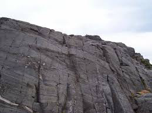
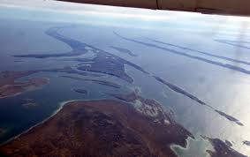
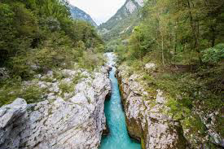
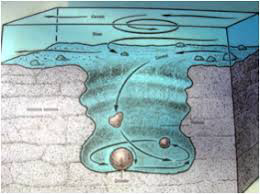
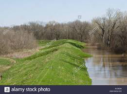
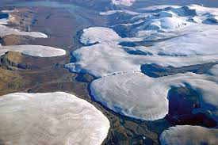
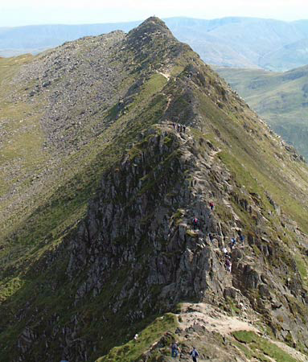
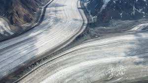
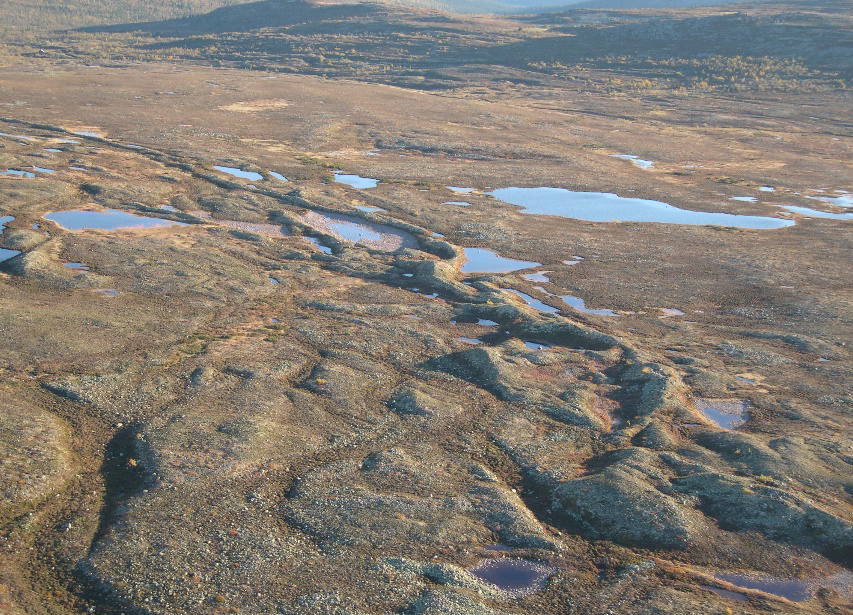

# Landforms

2020-04-28 23:48:56

- [Landforms](#landforms)
- [Mineral and Rocks](#mineral-and-rocks)
	- [Rocks](#rocks)
		- [Igneous Rocks](#igneous-rocks)
		- [Sedimentary Rocks](#sedimentary-rocks)
		- [Metamorphic Rocks](#metamorphic-rocks)
- [Geomorphic Processes](#geomorphic-processes)
	- [Endogenic Geomorphic Processes](#endogenic-geomorphic-processes)
	- [Exogenic Geomorphic Processes](#exogenic-geomorphic-processes)
		- [Types](#types)
			- [Erosion and Deposition](#erosion-and-deposition)
	- [Running Water](#running-water)
		- [Characterstics of Various Stages of Rivers](#characterstics-of-various-stages-of-rivers)
		- [Running Water Erosional Landforms](#running-water-erosional-landforms)
		- [Running Water Depositional Landforms](#running-water-depositional-landforms)
	- [Groundwater](#groundwater)
		- [Groundwater Erosional Landforms](#groundwater-erosional-landforms)
		- [Groundwater Depositional Landforms](#groundwater-depositional-landforms)
	- [Glaciers](#glaciers)
		- [Glacier Erosional Landforms](#glacier-erosional-landforms)
		- [Glacier Depositional Landorms](#glacier-depositional-landorms)

---

# Mineral and Rocks

- Have fixed atomic structure, definite chemical composition, 2 or more elements
- Crystals appear when Magma cools,

**Physical characterstics of minerals** :

- External **crystal form** ex cubes, hexagonal etc
- **Cleavage** - tendency to break forming plane surfaces
- **Fracture** - Crystals break irregularly not along cleavage
- Lustre
- Other characterstics are colour, streak (colour of ground powder), transparency, structure, hardness and specific gravity.

Metallic Mineral : contain metals ex Precious metals, Ferrous and Non Ferrous metals
Non Metallic - ex Sulphur, Nitrates etc

## Rocks

- Do not have definite compositin of minerals
- Petrology is study of rocks

### Igneous Rocks

- Formed by cooling and solidification of Magma and Lava aka primary rocks
- If molten material is cooled slowly at great depths mineral grains will be **very large**
- Sudden cooling will result in **small and smooth** grains, Intermediate condition will make medium sized grains
- Examples of igneous rocks are granite, gabbro, pegmatite, basalt, volcanic breccia and tuff

### Sedimentary Rocks

- Formed when Igneous, Sedimentary, Metamorphic rocks undergo denudation are later carried and deposited
- Compaction results in their formation aka **lithifaction**

What are the different types of Sedimentary rocks?

- **Mechanically** formed eg sandstone, conglomerate, limestone, shale, loess
- **Organically** formed eg geyserite, chalk, limestone, coal etc
- **Chemically** formed eg chert, limestone, halite, potash etc.

### Metamorphic Rocks

- Changes form under action of Pressure, Volume, Temp
- Techtonic process force rocks down which come into contact w/ molten magma, rocks above subject huge pressure -> recrystallisation, reorganisation.
- **Dynamic Metamorphism** : change due to rushing and breaking but w/o chemical change
- **Thermal Metamorphism** :
	- **Contact** metamorphism - occurs when rocks come into contact with hot magma and lava
	- **Regional** metamorphism occurs due deformation caused by tectonic shearing.
- Rocks, grains or minerals get arranged in layers or lines during metamorphism this is called **Foliation** or **Lineation**
- Alternating layer of light and dark shades in minerals are called **Banding**
- MR Classified into foliated and Non foliated
- Examples rocks are : **Gneissoid, Granite, Syenite,** Slate, Schist, Marble, Quartzite

# Geomorphic Processes

- Forces that bring change to surface.
- Exogenic forces cause degradation and aggradation on surface ex Weathering, wasting, erosion and deposition.
- Gradation : Wearing down of relief variation through erosion.

## Endogenic Geomorphic Processes

- Energy from within ex Radioactivity, Rotation and Tidal Friction and Primordial heat
1. Diastrophism : cause surface to move, elevate, build up earth's crust . Various types of diastrophic processes are :
	- **Orogenic** : mountain building through **severe folding** and affects long and narrow belts of earth
	- **Epeirogenic** : uplift or warping of large parts of crust; continental building process.
	- Earthquakes
	- Plate techtonics
2. [[1.1 Earth#Volcanoes|Volcanism]]

## Exogenic Geomorphic Processes

- Energy source is atmosphere
- ==All exogenic forces cause denudation== of material
- Mechanical and chemical decomposition by weather and climate : Weathering
- Weathering, Mass Wasting, Erosion and Deposition are examples

### Types

- ##### **Weathering** :
	- Mechanical disintegration and Chemical decomposition
	- causes are geological, climatic, topographic, vegetative factors
		- Chemical : ex carbonation, hydration, oxidation etc
		- Physical/Mechanical : ex gravity, expansion due to temp, water pressure
		- Biological : changes caused due to growth/movement of organisms

	Exfoliation #card-reverse

	- Result of Weathering
	- **Flaking of curved sheets of shells** from rocks etc to form smooth and rounded surface
	- caused due to expansion and contraction
- ##### Mass Movement
	- Rock debris movt under direct influence of Gravity
	- Weathering not a prerequisite
	- No geomorphic processes participate viz glaciers, wind, waves, currents etc
	- Heave, flow and slide are types of movt

	Landslides

	- Rapid movt of rock in a slope without backward movt is called Slide
	- Slump is flow w/ backwards rotation of material, slide has no such phenomena

#### Erosion and Deposition

- Weathering not a precondition
- Deposition is consequence of erosion when agents lose their[[Soils#Soil Formation|Soil Formation]] is a consequence of it

---

[[kegy205.pdf]] - Minerals and Rocks
[[kegy206.pdf]] - Geomorphic Processes

---

## Running Water

When rivers reach maturity in lower slopes, lateral erorsion causes flat low relief plain called peneplaing, the other formation is a Monadnock.

- Isolated hill of bedrock standing above the general level is called a **Monadnock**, aka inselberg.
	- 
- Low-relief plain formed by protracted erosion is called Peneplain.
	- 

### Characterstics of Various Stages of Rivers

- Youth
	- **V shaped valleys**, **Waterfalls**, **Rapids**, Interlocking spurs, Potholes,
	- Meanders can also exist but not widely present
	- Vertical erosion causes **steep sides and narrow frills** to form V Shaped valleys
- Mature
	- Floodplains, deep V shaped valleys, strean divides become sharp
	- Swamps and Marshes of Y stage disappear
- Old
	- Vast **Floodplains**, **Ox bow lakes**, Deltas, Natural Levees

### Running Water Erosional Landforms

- Valleys
	- Start as rills -> gullies -> valleys
	- V-shaped, Gorge, Canyon are types
	- Deep valleys with steep to straight sides they are formed in hard rocks called gorges.
	- 
	- Gorge that have steep step like slope are canyons
		- wider at the top than at bottom and forms on sedimentary rocks
- Potholes and Plungepools
	- Circular depressions formed in rocky beds of hill streams through stream erosion and abrasion of rocks are called Potholes.
	- 
- Series of potholes is a plungepool, formed due to constant rotation of boulders and impact of water within a pothole
- 
- Incised/Entrenched Meanders
	- When meanders form in hard rocks they are called Incised or entrenched meanders
- River Terraces
	- Formed due to vertical erosion by the stream into its own depositional floodplain
	- 
	- When river terraces occur on either side they are called Paired terraces

### Running Water Depositional Landforms

- Alluvial Fans
	- formed at foot slope of low gradient when load becomes too heavy for streams to carry
	- **cone shaped deposit**
	- forms many distributaries
- Deltas
	- Similar to Alluvial fans but form at mouths of river.
	- Well sorted with clear stratification - coarser material settles first finer ones carried to sea
- Floodplains
	- formed when water spills over the banks and deposits silt and clay
	- When they are above the banks called inactive floodplain.
	- contain 2 types of deposit : flood and channel deposits.
	- Natural Levees.
      - **Low linear and parallel ridges of coarse deposits** along the banks of river are called
	- 
	- Point Bars aka Meander **Bars found in concave side of ox bow** lakes are sediments deposited in*linear fashion* along banks contains *mixed size of sediments*
- Meander
	- Formed due to lateral erosion of streams flowing over gentle slope common in flood and delta plains
	- 
	- not a **landform** but a type of **channel pattern** formed due to :
		- Lateral erosion in gentler slopes
		- unconsolidate alluvial deposits exerting lateral pressure
		- coriolis force acting

## Groundwater

### Groundwater Erosional Landforms

- Karst topography
	- formed **underground** due to **dissolution of sloluble rocks** viz limestone, dolomite, gypsum etc
	- characterised by sinkholes and caves. 
	- 
		- Small to medium sized *round to sub rounded shallow depressions*
		- formed on the **surface of limestones**
	- **Sinkholes**
		- openings circular at top and funnel shaped towards bottom
		- connected to a cave/roof of a void at the bottom
		- may collapse forming **dolines**
	- Uvalas
		- **Closed Karst depressions**
		- formed when sink holes and dolines join together because of slumping of materials along the margins or due to roof collapse.
- Lapies or Karren or Ridges
	- **Irregular, grooved, ridge like features** in an open limestone field
	- formed ***due to solution activity*** along parallel and sub parallel*joints*
	- eventually transform into limestone pavements
- Caves
	- formed when water percolates and dissolves limestones
	- Cave w/ openings on both sides called tunnels

### Groundwater Depositional Landforms

- **Stalacites** hang like icicles in caves they drip to form **Stalgamites** at bottom.
- Eventually both join to form pillars and columns

## Glaciers

- Piedmont glacier
	- **valley glacier** that spilled onto relatively flat plains 
  	- 

### Glacier Erosional Landforms

- Cirques
	- bowl-shaped, deep, long and wide depressions that glaciers carve into mountains and valley sidewalls at high elevations.
	- Lakes can form at such places they are called cirque or tarn lakes.
- Horns
	- formed when 3 or more radiating glaciers cut headward until their cirques meet.
- Serrated/Saw Toothed Ridges
	- divide between cirques or head walls get narrow and turn into Serrated or saw tooth ridges aka **Aretes.**
	- 
- Glacial Valleys/ Troughs
	- U Shaped w/ broad floors, smooth and steep sides
	- may contain Moraines
	- Fjords are Deep glacial troughs filled with sea water making up the shorelines.

### Glacier Depositional Landorms

- **Glacial tills - unassorted, coarse and fine debris** dropped by melting galciers. Rock fragments are angular/sub angular
- Moraines are Glacially formed **accumulation of unconsolidated glacial debris (regolith and rock)**
- 
- Outwash deposits are glacio fluvial deposits are stratified and assorted
- Moraines
	- long ridges of deposits of glacial tills
	- Types of Moraines :
		- Lateral moraines : parallel to valleys they join to from horse shoe shaped ridge.
		- Ground Moraine : formed by retreating glacier leave irregular sheet of till
		- Medial Moraine in the centre.
	- Hanging Valleys are tributary valleys that hang above the main valley, commonly seen in U Shaped valleys.
- Winding ridge of ***un-assorted depositions*** of rock, gravel, clay etc. running along a glacier ***in a till plain*** are called Eskers
- 
- Drumlin :
	- Inverted boat-shaped deposition in a till plain caused by deposition
	- has a stoss end and a tail
	- composed of gravel, sand

---

[[kegy207.pdf]] - Landforms and their evolution

---
